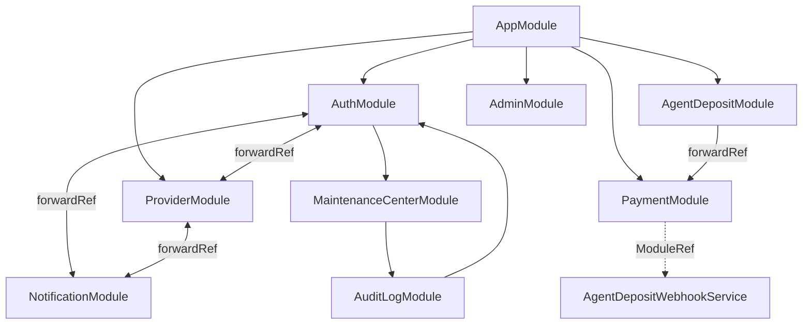

# Build 6033.3.2 — ARCHITECTURE STABILIZATION

**Footer:** `6033.3.2 ARCHITECTURE STABILIZATION`

Stabilization-only build — no new business logic, no schema migration, no engine changes.

---

## 1. Architecture Audit Report

### Stack inventory

| Layer | Components |
|-------|------------|
| **API** | NestJS 11, 39 modules, global prefix `api/v1`, partner API at `/api/partner/v1` |
| **Worker** | `WorkerAppModule` — BullMQ consumers (provider, topup, notification) |
| **Redis** | Queue + throttler (in-memory default) + worker heartbeat |
| **Admin** | Next.js 15 — ops, finance, marketing, monitoring, configuration |
| **Partner** | Next.js 15 — API-first B2B (wallet, orders API, API center) |
| **Customer** | Next.js 15 — `customer.localhost` portal + legacy `/tai-khoan` on public host |
| **Public** | Next.js 15 — B2C storefront on `localhost` |
| **DB** | PostgreSQL + Prisma (37 migrations, unchanged this build) |

### Findings (not auto-deleted)

| Category | Finding |
|----------|---------|
| **Unused module surface** | `ProviderController` — empty, zero routes |
| **Duplicate admin routes** | `/settings/*` ∥ `/configuration/*`; `/audit` ∥ `/configuration/audit`; `/configuration/feature-flags` re-exports system page |
| **Duplicate web account** | `/account/*` ∥ `/tai-khoan/*` (same components); `(customer)/*` parallel portal |
| **Legacy partner redirects** | `/balance`, `/api-keys`, `/docs`, `/kyc`, `/transactions` → canonical (stubs kept) |
| **Obsolete partner clients** | Removed 5 dead `*PageClient.tsx` under legacy redirect-only routes |
| **Duplicate providers (Nest)** | `PlatformMaintenanceGuard` in Auth + MaintenanceCenter; `CmsRepository` in Cms + AuditLog |
| **Unused exports** | `FinanceModule` exports not imported elsewhere |
| **Admin nav gaps** | `/agents`, `/staff`, `/support/tickets` exist but no sidebar link |
| **English UI remnants** | Admin Configuration Center labels; partner dashboard stat labels; some admin monitoring labels |

### Partner sidebar (verified API-first)

Bảng điều khiển · Ví · Đơn hàng API · API · Báo cáo · Hóa đơn · Thông báo · Tài khoản

Enterprise routes (`/finance/*`, `/products`, `/users`, `/support`) hidden — direct URL only.

### Customer sidebar (verified)

Bảng điều khiển · Đơn hàng · Mã PIN · Thông báo · Hồ sơ · Bảo mật · Hỗ trợ

---

## 2. Dependency Graph (NestJS)



**Recommendations (6033.4+):** Extract shared guards to `@Global()` maintenance module; collapse Admin settings/configuration re-exports; consider empty `ProviderController` removal.

---

## 3. Removed Legacy List (confirmed unused)

| File | Reason |
|------|--------|
| `apps/partner/app/balance/BalancePageClient.tsx` | Route redirects to `/wallet` only |
| `apps/partner/app/api-keys/ApiKeysPageClient.tsx` | Route redirects to `/api` only |
| `apps/partner/app/docs/DocsPageClient.tsx` | Route redirects to `/api/docs` only |
| `apps/partner/app/kyc/KycPageClient.tsx` | Route redirects to `/account/kyc` only |
| `apps/partner/app/transactions/TransactionsPageClient.tsx` | Route redirects to `/orders` only |

Redirect `page.tsx` stubs **kept** for backward compatibility.

---

## 4. RBAC Report

**Admin permissions (seed):** 49 codes — `users.read`, `orders.*`, `payments.*`, `audit.*`, `activity.*`, `queue.*`, `webhook.*`, `configuration.*`, `maintenance.*`, `finance.*`, etc.

**Duplicated semantics (candidates for 6033.4 merge, not changed):**

| Pair | Note |
|------|------|
| `audit.view` / `audit.read` | Overlapping audit access |
| `payments.view` / `payments.review` | Different actions, keep both |
| `cards.reveal` / `card.pin.view` | Legacy vs secure PIN |

**Partner platform permissions:** Separate matrix in `AGENT_ROLE_PERMISSIONS` (OWNER/MANAGER/FINANCE/OPERATOR/READONLY) — mapped to sidebar via `can(permission)`.

**Gap:** Admin `/agents`, `/staff` routes lack explicit nav + permission UX audit in UI (API guarded).

---

## 5. Performance Report

| Area | Observation | Action this build |
|------|-------------|-------------------|
| **Frontend bundles** | 3 independent Next apps, duplicate `components/ui/*` | Documented; no merge (scope) |
| **npm workspaces** | Added `@cardon/build-info` shared package | Reduces version string duplication |
| **Dynamic import** | Limited use in admin/partner | No change (safe default) |
| **Nest bootstrap** | Module graph depth from forwardRef cycles | Documented; no refactor |
| **Docker layers** | Frontend Dockerfile now copies `packages/` | Slightly better cache for shared pkg |

---

## 6. Files Modified (6033.3.2)

### Shared

- `packages/build-info/` — **BuildInfoService**
- `package.json` — workspace entry
- `docker/Dockerfile.frontend` — unified `BUILD_VERSION`, packages copy
- `docker-compose.local-full.yml` — `6033.3.2`, unified env
- `src/config/configuration.ts` — default build label

### Partner

- `lib/build-version.ts`, `lib/agent-platform/navigation.ts`, `lib/partner-session.ts`
- `app/(platform)/account/*` — canonical account route
- `next.config.ts` — `/settings` → `/account`, removed `/invoices` → settlements redirect
- `components/api/ApiSubNav.tsx`, `components/layout/Sidebar.tsx`
- `app/(platform)/api/ApiCenterPageClient.tsx`, `settings/SettingsPageClient.tsx`
- Deleted 5 legacy PageClients (see §3)

### Admin / Web

- `lib/build-version.ts`, `next.config.ts` (transpilePackages)
- `components/layout/AdminShell.tsx`, `BuildVersionComment.tsx`
- `lib/customer-portal/navigation.ts`, `components/customer/CustomerShell.tsx`
- `app/(customer)/*` — Vietnamese titles
- `components/customer/CustomerPlaceholder.tsx`

---

## 7. Routing Standardization

| Portal | Canonical | Legacy redirect |
|--------|-----------|-----------------|
| Partner account | `/account` | `/settings`, `/settings/*` |
| Partner KYC | `/account/kyc` | `/kyc` |
| Partner wallet | `/wallet` | `/balance` |
| Partner API | `/api` | `/api-keys` |
| Partner invoices | `/invoices` | *(redirect to settlements removed)* |
| Admin config | `/configuration` | `/settings` → `/configuration` |

---

## 8. BuildInfoService

Single provider: `packages/build-info/src/build-info.service.ts`

```typescript
BuildInfoService.resolveVersion()
BuildInfoService.footerLabel()   // "Build 6033.3.2 ARCHITECTURE STABILIZATION"
BuildInfoService.htmlComment()
```

Env priority: `NEXT_PUBLIC_BUILD_VERSION` → `BUILD_VERSION` → legacy per-app vars → default constant.

---

## 9. Recommendations before Build 6033.4

1. Complete Admin `/settings` → `/configuration` migration (delete duplicate page files)
2. Merge `audit.view` + `audit.read`; deprecate `cards.reveal`
3. Unify customer account: migrate `/tai-khoan` → `(customer)` portal or vice versa
4. Việt hóa Admin Configuration Center (`vi.configuration`)
5. Remove empty `ProviderController` or add health stub route
6. Deduplicate `PlatformMaintenanceGuard` registration
7. Shared UI package for `Button`/`Input`/`Badge` across apps
8. Redis-backed throttler for multi-instance API

---

## 10. Verification Checklist

- [ ] `npm install` (workspace `@cardon/build-info`)
- [ ] `npm run build` (API)
- [ ] `npm run build:admin|partner|web`
- [ ] `docker compose build` all services
- [ ] http://localhost · customer · partner · admin — HTTP 200
- [ ] Footer: **6033.3.2 ARCHITECTURE STABILIZATION**

---

## Not Modified

Payment Engine, Provider Engine, Ledger, Order Engine, Webhook, Queue, Notification, Monitoring/Configuration/Maintenance **business logic**, database schema.
