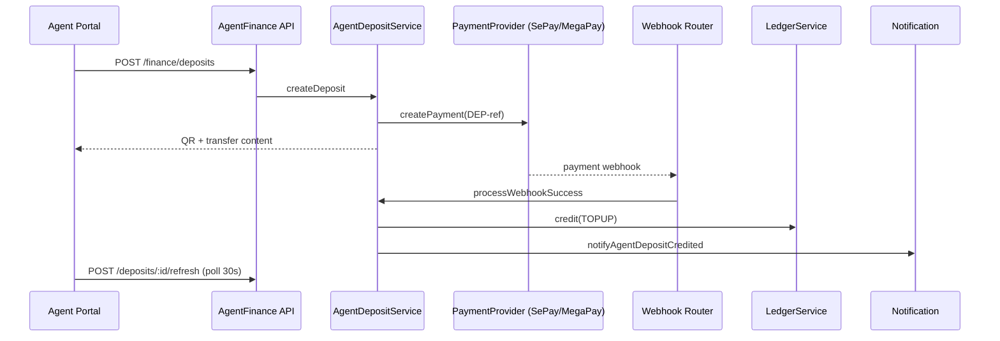

# Build 6033.3 — Agent Money Flow & Deposit Center

**Build footer:** `6033.3 AGENT MONEY FLOW`

---

## Objective

First real financial workflow for Agent Platform: **Agent Deposit** via existing Payment Gateway infrastructure (SePay, MegaPay). No Payment Engine, Ledger Engine, or Provider Engine rewrites.

---

## Money Flow

```
Agent → Nạp tiền → Nhập số tiền → Chọn Gateway
  → Sinh giao dịch (DEP-* reference)
  → QR / Thông tin chuyển khoản
  → Thanh toán
  → Webhook (/payments/webhook/:gateway)
  → AgentDepositWebhookService (DEP-* routing)
  → Ledger credit (TOPUP)
  → Wallet Summary (derived from Ledger)
  → Notification
  → Activity Log
```

Wallet balance is **never** updated directly. `Agent.balance` changes only through `LedgerService.credit()`.

---

## Sequence Diagram



---

## Gateway Flow

- Uses `PaymentProviderRegistry` — same SePay/MegaPay providers as B2C
- Gateway selection via `SettingsStoreService.resolvePaymentGatewaySelectionOrder()`
- Priority: SePay (1) → MegaPay (2); disabled/maintenance gateways skipped
- Transfer content: `CARDON DEP-{ref}` (SePay extracts DEP-* references)

---

## Ledger Flow

On webhook success:

| Field | Value |
|-------|-------|
| Type | CREDIT |
| referenceType | TOPUP |
| referenceId | agent_deposit.id |
| description | Gateway deposit via {gateway} |
| createdById | null (system) |

---

## Wallet Summary

`GET /agents/me/wallet/summary` and overview derive from ledger entries. Additional deposit metrics:

- `pendingDeposit` — sum of AWAITING_PAYMENT deposits
- `depositedToday` / `depositedMonth` — credited deposit net amounts

---

## Data Model

**Table:** `agent_deposits`

| Status | Label |
|--------|-------|
| INIT | Khởi tạo |
| AWAITING_PAYMENT | Đang chờ thanh toán |
| PAID | Đã thanh toán |
| RECORDED | Đã ghi nhận |
| CREDITED | Đã cộng ví |
| EXPIRED | Hết hạn |
| FAILED | Thất bại |
| CANCELLED | Đã hủy |

---

## RBAC

| Action | Owner | Manager | Finance | Operator | Readonly |
|--------|-------|---------|---------|----------|----------|
| View deposits | ✓ | ✓ | ✓ | ✓ | ✓ |
| Create deposit | ✓ | ✓ | ✓ | ✓ | ✗ |
| Export | ✓ | ✓ | ✓ | ✓ | ✗ |

---

## API

| Method | Path | Description |
|--------|------|-------------|
| GET | `/agents/me/finance/deposits` | List + available gateways |
| GET | `/agents/me/finance/deposits/:id` | Detail + timeline |
| POST | `/agents/me/finance/deposits` | Create (Idempotency-Key required) |
| POST | `/agents/me/finance/deposits/:id/refresh` | Poll / expire check |
| GET | `/agents/me/wallet/summary` | Ledger-derived summary (unchanged) |

Webhook: existing `POST /payments/webhook/:gateway` — routes DEP-* to `AgentDepositWebhookService` before Payment Engine.

---

## UI

Route: `/finance/deposits`

- Create form (amount, gateway, fee preview)
- QR panel with countdown
- Copy transfer content
- Refresh status button
- Timeline visualization
- 30s polling until terminal status
- Export CSV/Excel/PDF
- Vietnamese labels throughout

---

## Notifications

| Event | Type |
|-------|------|
| Có tiền vào ví | AGENT_DEPOSIT_CREDITED |
| Thanh toán thất bại | AGENT_DEPOSIT_FAILED |
| Giao dịch hết hạn | AGENT_DEPOSIT_EXPIRED |

---

## Activity Log

- Tạo yêu cầu nạp
- Làm mới trạng thái
- Xem chi tiết
- Export

No Audit Log (config unchanged).

---

## Future Withdraw Flow

1. Agent withdraw request model
2. Admin approval workflow
3. Ledger DEBIT on payout
4. `/finance/withdraws` execution UI

---

## Not Changed

- PaymentService core logic
- Provider Engine
- LedgerService core logic
- Order Engine
- Monitoring, Configuration, Maintenance

---

## Deploy

```bash
docker compose -f docker-compose.local-full.yml --env-file .env.local-full build
docker compose -f docker-compose.local-full.yml --env-file .env.local-full up -d
```

Verify: `http://partner.localhost/finance/deposits`

Footer: **6033.3 AGENT MONEY FLOW**
