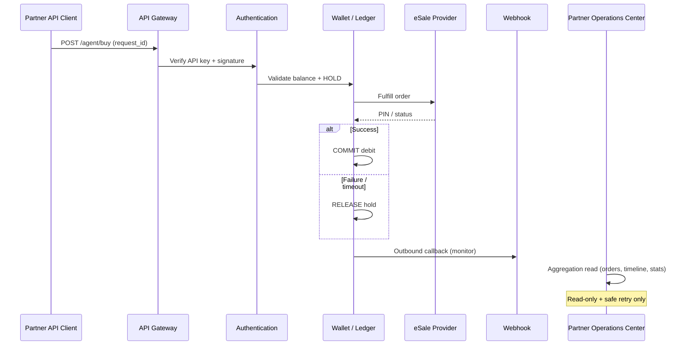

# BUILD 6033.4 — API ORDER OPERATIONS CENTER

**Build:** `6033.4 API ORDER OPERATIONS CENTER`  
**Previous:** `6033.3.2 ARCHITECTURE STABILIZATION`

## Goal

Professional B2B **API Order Operations Center** in the Partner Portal. Partner orders are created **only via API**. The portal is for monitoring, search, inspection, safe retry, export, latency tracking, and integration troubleshooting — **not** shopping cart or checkout.

## Architecture

```
API Client
    ↓
API Gateway
    ↓
Authentication
    ↓
Wallet Validation
    ↓
Ledger Hold
    ↓
Provider (eSale)
    ↓
PIN Response
    ↓
Ledger Commit / Release
    ↓
Webhook
    ↓
Logs
    ↓
Reports
```

No manual purchase UI. No checkout. No product catalog in this module.

## Sequence Diagram



## Order Lifecycle

1. **API** — Request received with `request_id` (idempotent)
2. **Wallet Hold** — Ledger hold on agent balance
3. **Provider** — eSale fulfillment request
4. **Response** — Provider payload (PIN masked in portal)
5. **Webhook** — Outbound partner notification (read-only monitor)
6. **Ledger** — Commit or release hold
7. **Notification** — In-app / system notifications
8. **Activity** — Partner activity log (view, export, retry)
9. **Completed** — Terminal state

## Partner UI (Vietnamese)

| Route | Label |
|-------|-------|
| `/orders` | Tổng quan |
| `/orders/search` | Tra cứu |
| `/orders/history` | Lịch sử |
| `/orders/webhooks` | Webhook |
| `/orders/logs` | Nhật ký |
| `/orders/export` | Xuất dữ liệu |
| `/orders/[id]` | Chi tiết |
| `/orders/[id]/trace` | Trace vòng đời |

## Aggregation APIs (new)

All under `GET/POST /agents/me/orders` — **no Payment/Order/Provider engine rewrites**.

| Method | Path | Purpose |
|--------|------|---------|
| GET | `/agents/me/orders` | Paginated list + filters |
| GET | `/agents/me/orders/:id` | Detail + masked payloads |
| GET | `/agents/me/orders/statistics` | Dashboard cards + charts |
| GET | `/agents/me/orders/timeline?orderId=` | Lifecycle timeline |
| GET | `/agents/me/orders/search?q=` | Global fuzzy search |
| GET | `/agents/me/orders/export?format=` | CSV/Excel/PDF/JSON |
| GET | `/agents/me/orders/export/:jobId` | Background export status |
| GET | `/agents/me/orders/webhooks` | Webhook monitor |
| GET | `/agents/me/orders/logs` | Activity log |
| POST | `/agents/me/orders/:id/retry` | Safe retry (idempotent) |
| POST | `/agents/me/orders/audit` | Activity recording |

## RBAC

| Role | View | Export | Retry |
|------|------|--------|-------|
| Owner | ✓ | ✓ | ✓ |
| Manager | ✓ | ✓ | ✓ |
| Operator | ✓ | ✓ | ✓ |
| Finance | ✓ | ✗ | ✗ |
| Readonly | ✓ | ✗ | ✗ |

Permissions: `orders.read`, `orders.export`. Retry blocked for `READONLY`.

## Retry Safeguards

- Never retry **COMPLETED** orders
- Only: `WAITING_ADMIN_RETRY`, `NEED_MANUAL_REVIEW`, `PROCESSING`, provider `TIMEOUT` / `FAILED`
- Uses existing `FulfillmentDispatchService.retryOrderFulfillment` — no duplicate order creation
- Respects idempotency via existing agent `request_id`

## Security

Masked in UI/API responses:

- PIN / card secrets
- API secret / webhook secret
- IP (partial mask)
- Tokens / signatures
- Sensitive JSON payload keys

Optional `?reveal=true` on detail for permitted roles (foundation: owner session).

## Performance

- Server-side pagination (`skip` / `take`)
- Lazy loading on pages
- No large client-side full dataset render
- Export > 5000 rows → in-process background job + poll

## Notifications

Reuses Notification Center patterns for:

- Export ready (background job)
- Provider timeout / high failure rate (via existing system notifications where applicable)
- Webhook failed / retry completed (activity log + future hooks)

## Activity Log

Recorded via `SystemActivityLog` (partner source, `agent_orders` resource):

- View detail, filter, search, timeline, export, retry

**Audit** (config changes only) — unchanged; normal viewing does not write audit entries.

## Files Added / Changed

**Backend**

- `src/modules/agent-platform/services/agent-order-operations.service.ts`
- `src/modules/agent-platform/controllers/agent-order-operations.controller.ts`
- `src/modules/agent-platform/utils/order-operations.mapper.ts`
- `src/modules/agent-platform/agent-platform.module.ts`

**Partner**

- `apps/partner/app/(platform)/orders/*` — overview, search, history, webhooks, logs, export, detail, trace
- `apps/partner/components/orders/OrdersOperations.tsx`
- `apps/partner/lib/agent-platform/navigation.ts`
- `apps/partner/services/api-client.ts` — `orderOperationsApi`
- `apps/partner/types/platform.ts`

**Build**

- `packages/build-info` → `6033.4 API ORDER OPERATIONS CENTER`
- `docker-compose.local-full.yml`

## Do Not Modify

- Payment Engine, Provider Engine, Ledger Engine, Webhook Engine, Order Engine
- Monitoring, Configuration, Maintenance modules
- Database schema (aggregation only)

## Future Enhancements

- Dedicated `agent_webhook_deliveries` table for outbound webhook retries
- Real-time WebSocket dashboard updates
- CSV streaming export via object storage + signed URLs
- Multi-user RBAC with per-member platform roles
- Provider latency SLA alerts to Telegram

## Verification

```bash
docker compose -f docker-compose.local-full.yml up --build -d
# Partner: http://partner.localhost/orders
# Footer: Build 6033.4 API ORDER OPERATIONS CENTER
```

Checklist: dashboard, search, timeline, webhook monitor, export, responsive layout, no checkout UI, Docker PASS.
