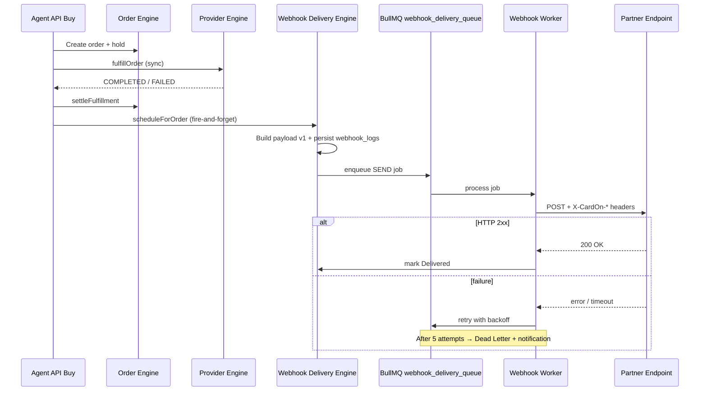

# BUILD 6033.7 — WEBHOOK DELIVERY CENTER

**Build label:** `6033.7 WEBHOOK DELIVERY CENTER`  
**Date:** 2026-06-18  
**Scope:** Outbound webhook delivery engine for B2B partners (Delivery Engine only — no Order/Payment/Ledger rewrites)

---

## Summary

Production-grade **outbound webhook delivery** for partner API orders:

- BullMQ async queue (`webhook_delivery_queue`)
- HMAC-SHA256 signatures with **event versioning** (`v1`)
- Retry policy: immediate → 1m → 5m → 15m → 30m (5 attempts)
- Dead Letter + Notification Center alerts
- Partner Portal delivery history UI (100% Vietnamese)
- Admin Webhook Monitor reuses same delivery records (`WebhookSource.PARTNER`, `direction: outbound`)

---

## Architecture



### Components

| Component | Path |
|-----------|------|
| Delivery service | `src/modules/webhook-delivery/services/webhook-delivery.service.ts` |
| Payload builder | `src/modules/webhook-delivery/services/webhook-delivery-payload.service.ts` |
| Queue producer | `src/modules/webhook-delivery/services/webhook-delivery-producer.service.ts` |
| Worker | `src/modules/webhook-delivery/workers/webhook-delivery.worker.ts` |
| Partner API | `GET/POST /agents/me/webhooks/deliveries*` |
| Storage | Existing `webhook_logs` table (`source: PARTNER`, `monitorMetadata.direction: outbound`) |

---

## Event Versioning

Headers:

```
X-CardOn-Signature: <hmac-sha256-hex>
X-CardOn-Timestamp: <unix-seconds>
X-CardOn-Event: order.completed
X-CardOn-Version: v1
```

Payload includes:

```json
{
  "version": "v1",
  "event": "order.completed",
  "request_id": "...",
  "order_id": "...",
  ...
}
```

Signature: `HMAC-SHA256(secret, timestamp + "." + rawBody)`

Future `v2` payloads can ship in parallel without breaking existing integrators.

---

## Retry Policy

| Attempt | Delay after previous failure |
|---------|------------------------------|
| 1 | Immediate |
| 2 | 1 minute |
| 3 | 5 minutes |
| 4 | 15 minutes |
| 5 | 30 minutes |

After attempt 5 → **Dead Letter** → in-app notification.

Manual retry (Owner / Admin) resets attempt counter and enqueues a fresh job.

---

## Queue Flow

1. `scheduleForOrder(orderId)` — non-blocking, called after agent order settlement
2. Idempotency key: `paymentReference = PD:{orderId}:{event}`
3. Job name: `webhook.delivery.send`
4. Worker custom backoff via `webhookDeliveryBackoffDelay`
5. HTTP timeout: **5 seconds**
6. Max payload: **256 KB**
7. HTTPS required (localhost allowed for dev)

---

## Delivery Statuses

`Pending` → `Sending` → `Delivered`  
or `Failed` → `Retrying` → `DeadLetter`  
or `Cancelled` (Owner manual)

---

## RBAC

| Role | View history | Retry | Cancel |
|------|--------------|-------|--------|
| Owner | ✓ | ✓ | ✓ |
| Manager | ✓ | — | — |
| Operator | ✓ | — | — |
| Readonly | ✓ | — | — |

---

## Partner API

```
GET  /agents/me/webhooks/deliveries
GET  /agents/me/webhooks/deliveries/:id
POST /agents/me/webhooks/deliveries/:id/retry
POST /agents/me/webhooks/deliveries/:id/cancel
GET  /agents/me/webhooks/statistics
```

Webhook **configuration** remains at `/agents/me/security/webhook`.

---

## Admin Monitor

`WebhookMonitorModule` derives status for `PARTNER` outbound rows from `monitorMetadata.deliveryStatus`.  
Admin retry on partner deliveries delegates to `WebhookDeliveryService.adminRetryDelivery`.

---

## Activity & Audit

**Activity log:** retry, cancel, view detail (partner)  
**Audit log:** webhook URL, secret rotation, enable/disable only (config changes in `AgentSecurityService`)  
Viewing delivery history does **not** create audit entries.

---

## Partner UI

- `/api/webhook` — security & URL config
- `/api/webhook/deliveries` — tabs: Lịch sử giao, Hàng đợi thử lại, Dead Letter
- `/api/webhook/deliveries/[id]` — detail, copy payload/signature, download JSON

---

## Deployment

```bash
docker compose -f docker-compose.local-full.yml --env-file .env.local-full build api partner admin web worker
docker compose -f docker-compose.local-full.yml --env-file .env.local-full up -d --force-recreate api partner admin web worker nginx
```

### Verification checklist

- [ ] Docker build PASS
- [ ] Worker healthy (`APP_ROLE=worker`)
- [ ] `webhook_delivery_queue` processing
- [ ] Partner login `agent@test.local` → API Center → Webhook → Lịch sử giao
- [ ] Admin → Webhook Monitor shows Partner outbound deliveries
- [ ] Mock endpoint HTTP 200 receives signed payload
- [ ] Forced failure → retry → Dead Letter
- [ ] Footer: **6033.7 WEBHOOK DELIVERY CENTER**

---

## Docker / Test Results (fill after deploy)

| Check | Status | Notes |
|-------|--------|-------|
| Docker build | **PASS** | api, worker, partner, admin |
| Container status | **PASS** | worker healthy, WebhookDeliveryWorker ready |
| Mock webhook HTTP 200 | _manual_ | Configure mock URL in partner webhook settings |
| Retry / DLQ test | _manual_ | Use failing endpoint then manual retry |
| Browser verification | _manual_ | partner.localhost → API Center → Lịch sử giao |
| Regression | _pending_ | API buy smoke test recommended |

---

## Known Issues

- Async provider-only completion paths rely on `ensureOrderSettled` / replay unless a future hook is added to the provider worker.
- View-detail activity is logged to Activity Log but not Audit (by design).

---

## Future Improvements

- Webhook `v2` schema with optional fields behind version header
- Per-event subscription UI
- Webhook delivery SLA dashboard
- Signed replay protection (nonce / idempotency-key header)
- Dedicated `webhook_deliveries` table if `webhook_logs` volume grows

---

**Footer:** `6033.7 WEBHOOK DELIVERY CENTER`
