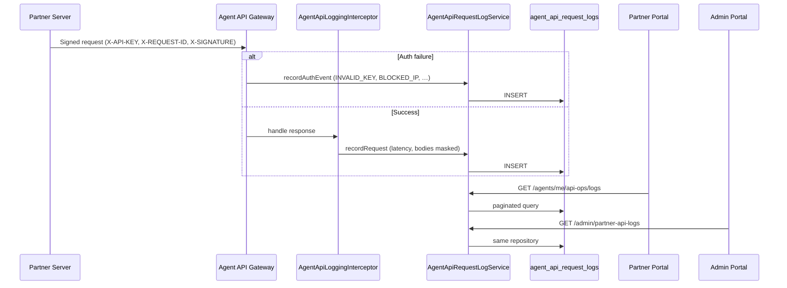

# BUILD 6033.8 — API OBSERVABILITY & DEVELOPER CENTER

**Build label:** `6033.8 API OBSERVABILITY & DEVELOPER CENTER`  
**Date:** 2026-06-18  
**Scope:** Partner API Operations layer — persistent logs, documentation, test console, usage stats, admin inspection. No Order/Payment/Provider/Ledger/Webhook engine rewrites.

---

## Summary

Self-service API observability for B2B partners:

- **Persistent API logs** in PostgreSQL (`agent_api_request_logs`)
- **Search & filters** — request ID, order ID, IP, keyword, HTTP status, endpoint
- **Log detail** — headers, request/response (masked), timeline
- **API documentation** — real CardOn Partner API reference (Vietnamese UI)
- **Test API console** — server-side signed requests (Buy, Balance, Transaction, Products, Providers)
- **Error code center** — common codes with meaning, cause, solution
- **Usage dashboard** — today / 7d / 30d stats
- **Export** — immediate (≤500 rows) or background job + Notification Center
- **Activity log** — export, test, view detail (no audit on passive viewing)
- **Admin Partner API Logs** — same data source as Partner Portal

---

## Architecture



### Components

| Component | Path |
|-----------|------|
| Module | `src/modules/api-observability/` |
| Prisma model | `AgentApiRequestLog` → `agent_api_request_logs` |
| Interceptor | `interceptors/agent-api-logging.interceptor.ts` |
| Partner API | `GET/POST /agents/me/api-ops/*` |
| Admin API | `GET /admin/partner-api-logs` |
| Retention | `ApiLogRetentionService` — default **90 days** |
| Masking | `utils/api-log-mask.util.ts` — PIN, secrets, tokens |

---

## API Log Flow

1. Every Partner API hit on `AgentApiController` passes through `AgentApiLoggingInterceptor`.
2. Auth guard failures call `AgentApiRequestLogService.recordAuthEvent()` (via telemetry bridge).
3. Successful requests record method, endpoint, latency, masked headers/bodies, order IDs.
4. Partner Portal lists via server-side pagination (`page`, `limit`, `search`, filters).
5. Admin uses the same `AgentApiRequestLogRepository` without duplicate storage.

---

## Retention

- Default: **90 days** (`API_LOG_RETENTION_DAYS_DEFAULT`)
- `ApiLogRetentionService` runs daily purge via `setInterval` (no Nest schedule module)
- Configurable constant in `entities/api-observability.constants.ts`

---

## Test API

- Endpoint: `POST /agents/me/api-ops/test`
- Executes signed HTTP to `http://127.0.0.1:{port}/api/v1/api/partner/v1/...`
- Returns status, latency, masked request/response, cURL
- **RBAC:** `READONLY` role blocked

---

## Documentation

- Partner UI: `/api/docs` — `DocsPanel.tsx`
- Sections: Authentication, API Keys, IP Whitelist, Rate Limit, Webhook, endpoints, idempotency, real cURL/response examples
- Error codes: `/api/errors` — served from `API_ERROR_CODES` constant

---

## RBAC (Partner Portal)

| Role | Logs | Export | Test API |
|------|------|--------|----------|
| Owner | View | Yes | Yes |
| Manager | View | Yes (`api.manage`) | Yes |
| Operator | View | Yes (`api.manage`) | Yes |
| Readonly | View | No | No |

Passive log viewing is not written to activity audit.

---

## Performance

- Database persistence (replaces in-memory telemetry list)
- Server-side pagination, max 100 per page
- Skeleton loading on Partner UI tables
- Export: immediate ≤500 rows; larger sets → background job + in-app notification

---

## Deployment

```bash
docker compose -f docker-compose.local-full.yml --env-file .env.local-full build api partner admin web worker
docker compose -f docker-compose.local-full.yml --env-file .env.local-full up -d --force-recreate api partner admin web worker nginx
```

### Verify Partner (`http://partner.localhost`)

- Login: `agent@test.local` / `LocalTest2026!`
- API Center → Logs, Docs, Test API, Usage, Errors, Export
- Footer: `6033.8 API OBSERVABILITY & DEVELOPER CENTER`

### Verify Admin (`http://admin.localhost`)

- Monitoring → Partner API Logs — search, detail

---

## Out of Scope (unchanged)

Payment Engine, Provider Engine, Ledger Engine, Order Engine, Webhook Delivery Engine core, Wallet, Pricing, Notification Center business logic, Configuration/Maintenance Center business logic.
