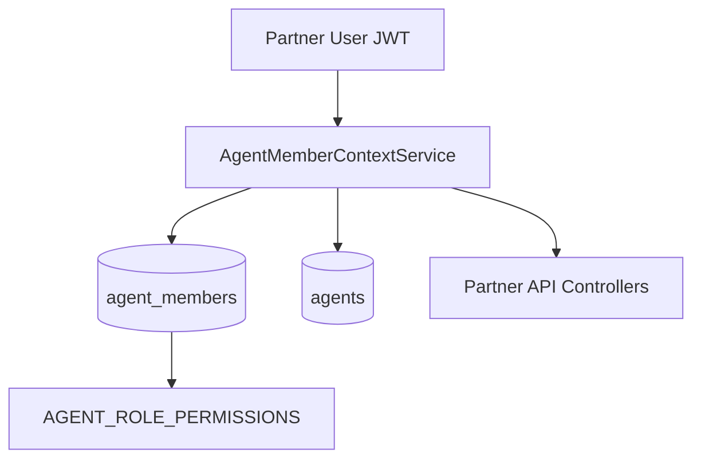

# BUILD 6033.9 — PARTNER ORGANIZATION & RBAC

**Build label:** `6033.9 PARTNER ORGANIZATION & RBAC`  
**Date:** 2026-06-18  
**Scope:** Multi-user organization, RBAC, invitations, sessions, login history, admin impersonation. No Payment/Order/Provider/Ledger/Webhook engine rewrites.

---

## Summary

Real B2B organization model for Partner Portal:

- **One Agent company → many users** sharing wallet, API keys, and orders
- **6 built-in roles:** OWNER, MANAGER, FINANCE, OPERATOR, DEVELOPER, READONLY
- **Permission matrix** enforced backend + frontend
- **User invitation** flow with email + role + expiration
- **Login history** and **session management**
- **SUPER_ADMIN impersonation** (read-only) with banner + audit
- **Admin agent support tools** — users list, impersonate, login history

---

## Architecture



### Components

| Component | Path |
|-----------|------|
| Module | `src/modules/agent-organization/` |
| Member context + cache | `services/agent-member-context.service.ts` |
| Organization CRUD | `services/agent-organization.service.ts` |
| Impersonation | `services/agent-impersonation.service.ts` |
| Login history | `services/agent-login-history.service.ts` + auth hook |
| Partner API | `/agents/me/organization`, `/users`, `/sessions`, … |
| Admin API | `/admin/agents/:id/organization/*`, `/impersonate` |
| Prisma | `agent_members`, `agent_member_invites`, `agent_login_histories`, `agent_impersonation_sessions` |

---

## Organization Model

- `Agent.userId` remains primary owner (legacy 1:1)
- `AgentMember` links additional users to same `agentId`
- `AgentRepository.resolveAgentForPortalUser()` resolves via member or owner
- Migration backfills existing owners as `AgentMember` role `OWNER`

---

## Permission Matrix

Defined in `src/modules/agent-platform/entities/agent-platform.constants.ts` (backend) and `apps/partner/lib/agent-platform/rbac.ts` (frontend).

| Role | Wallet | API Keys | Orders | Users |
|------|--------|----------|--------|-------|
| OWNER | ✓ | ✓ manage | ✓ export | ✓ manage |
| MANAGER | ✗ | read only | ✓ export | read |
| FINANCE | ✓ export | ✗ | read | ✗ |
| OPERATOR | ✗ | ✗ | ✓ export | ✗ |
| DEVELOPER | ✗ | ✓ manage | ✗ | ✗ |
| READONLY | read | read | read | read |

---

## Invitation Flow

1. OWNER invites email + role via `POST /agents/me/users`
2. Token stored in `agent_member_invites`
3. Invitee accepts via `POST /auth/accept-agent-invite`
4. New or existing `User` linked via `AgentMember`
5. Notification: invitation sent / accepted

---

## Impersonation Flow

1. SUPER_ADMIN → `POST /admin/agents/:id/impersonate`
2. Creates `agent_impersonation_sessions` + JWT with `impersonatedBy`, `impersonationReadOnly`
3. Partner Portal shows banner; destructive actions blocked
4. Activity + audit log recorded
5. `POST /admin/agents/impersonation/:sessionId/stop` ends session

---

## RBAC Enforcement

- `AgentMemberContextService.assertPermission()` on all organization mutations
- `AgentPlatformService.getSession()` returns real role from DB (no longer hardcoded OWNER)
- Frontend: `useAgentPlatform().can()` + nav filtering
- READONLY: no export, no retry, no test API (via permission codes)

---

## Security

- Horizontal privilege escalation prevented: users scoped to `agentId` from member record
- Locked/inactive members cannot resolve context
- Impersonation read-only blocks `.manage`, `.export`, `retry.manage`
- Password/secrets never exposed in organization APIs

---

## Deployment

```bash
docker compose -f docker-compose.local-full.yml --env-file .env.local-full build api partner admin web worker
docker compose -f docker-compose.local-full.yml --env-file .env.local-full up -d --force-recreate api partner admin web worker nginx
```

### Verify Partner (`http://partner.localhost`)

- Login: `agent@test.local` / `LocalTest2026!`
- Tài khoản → Tổ chức, Người dùng, Vai trò, Phiên, Lịch sử đăng nhập
- Footer: `6033.9 PARTNER ORGANIZATION & RBAC`

### Verify Admin (`http://admin.localhost`)

- Agents → detail → Đăng nhập với tư cách
- Organization users / login history tabs via API

---

## Out of Scope (unchanged)

Payment Engine, Provider Engine, Ledger Engine, Order Engine, Webhook Engine, Wallet Engine core, Pricing, Notification Center business logic.
