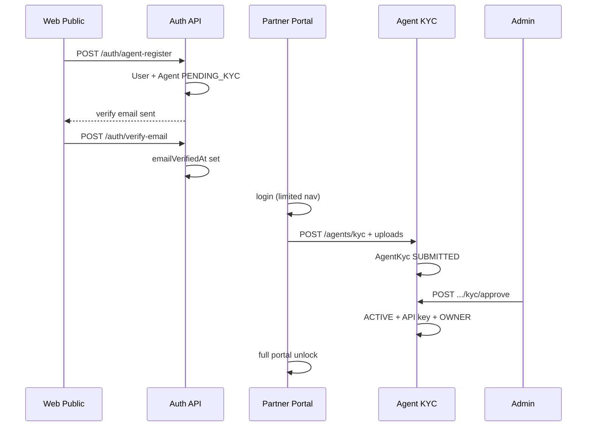
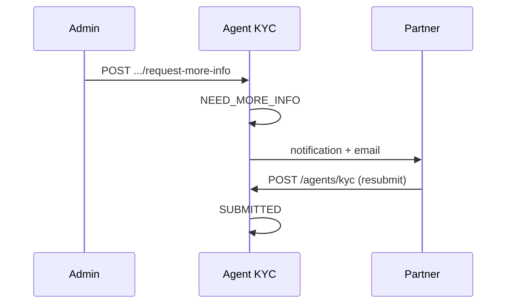

# BUILD 6035.2 — AGENT REGISTRATION & KYC CENTER (Aligned Spec)

**Build label:** `6035.2 AGENT REGISTRATION & KYC CENTER`  
**Prerequisite:** `6035.1.x PRICING SIMPLIFICATION` (margin config stable)  
**EPIC:** D — Partner Platform  
**Status:** Official implementation spec (aligned with codebase — **do not implement as a separate Registration Engine**)

---

## 1. Goal

Hoàn thiện **luồng onboarding B2B self-service** trên CardOn:

```
Website public → Đăng ký → Xác minh email → Partner Portal (hạn chế)
→ KYC → Admin duyệt → Agent ACTIVE → API / Ví / Nạp tiền
```

**Nguyên tắc:**

1. **Mở rộng** `AgentModule`, `AuthModule`, `AdminAgentCenterModule` — **không** tạo engine/module onboarding riêng.
2. **Giữ** model `Agent` + `AgentKyc` làm nguồn truth (không thêm bảng `agent_registrations` trừ khi phase sau có lý do audit/legal bắt buộc).
3. **Không** rewrite Payment, Order, Ledger, Provider, Webhook, Pricing resolution.
4. **Default path** = registration workflow; **SUPER_ADMIN** vẫn giữ đường invite/seed cho support & migration.

---

## 2. Alignment — Khác biệt so với spec gốc

| Spec gốc 6035.2 | Quyết định aligned | Lý do |
|-----------------|-------------------|-------|
| “Do NOT create Agent yet” | **Tạo `Agent` ngay sau bước register** (`PENDING_KYC`, `apiEnabled=false`) | Tái dùng toàn bộ Agent Center, KYC queue, ledger, statement; tránh dual source of truth |
| `POST /partner/register` | **`POST /auth/agent-register`** (public) + **`POST /agents/register`** (JWT, legacy/invite) | Khớp namespace API hiện có (`/api/v1/auth/*`, `/api/v1/agents/*`) |
| `GET /admin/registrations` | **Mở rộng** `GET /admin/agent-center/onboarding-queue` | Tránh module admin thứ 3; reuse aggregation layer 6034.0 |
| Settlement Engine riêng | **Không áp dụng** | Out of scope |
| “Admin NEVER manual create Agent” | **Registration là default**; invite + seed dev giữ cho SUPER_ADMIN | Vận hành thực tế |
| Dark/Light mode | **Optional — phase polish** | Chưa có design system theme đầy đủ |
| Default margin per agent | **Dùng global `AgentMarginConfig`** (6035.1); per-agent override = phase sau | `applyScope: ALL_AGENTS` hiện tại |
| Upload CCCD/GPKD | **Phase 2b** — reuse CMS media storage pattern | Infra upload có (`cms-media-storage`); cần bucket/policy KYC |

---

## 3. Baseline — CardOn hiện có

### 3.1 Backend

| Thành phần | Vị trí | Trạng thái |
|------------|--------|------------|
| Agent lifecycle | `src/modules/agent/services/agent.service.ts` | Register → KYC → approve/reject |
| KYC storage | `AgentKyc` model + `SubmitKycDto` | Form **doanh nghiệp** (6 field + 3 URL doc) |
| Approve side-effects | `approveKyc()` | ACTIVE, API key, audit, notification |
| Registration mode | `AgentRegistrationMode`: `INVITE_ONLY` \| `PUBLIC_APPROVAL` \| `DISABLED` | Enum có; public flow chưa UI |
| Invite | `AgentInviteService` + Admin `/agents/registration` | Invite link only |
| Admin KYC actions | `POST /admin/agents/:id/kyc/approve\|reject` | Permission `agents.kyc.review` |
| KYC queue read | `GET /admin/agent-center/kyc-queue` | List SUBMITTED |
| API gate | `agent-api-auth.service.ts` | Chặn nếu không ACTIVE + apiEnabled |
| Email verify infra | `emailVerificationToken`, `User.emailVerifiedAt` | Token tạo khi B2C register; **endpoint verify chưa public** |
| Organization | `AgentMember`, `AgentOrganizationService` | Multi-user foundation; **OWNER chưa auto-create on approve** |

### 3.2 Frontend

| Portal | Route / component | Trạng thái |
|--------|-------------------|------------|
| Partner | `/login`, Dashboard `RegisterAgentPanel` | Register **trong portal** nếu chưa có Agent |
| Partner | `/account/kyc` → `KycPanel` | Form DN, URL docs |
| Partner | Nav frozen (6033.4.1) | **Chưa** gate route theo KYC |
| Admin | `/agents/kyc`, `/agents/registration` | Queue + invite |
| Public web | — | **Chưa** có `/dang-ky-dai-ly` |

---

## 4. Architecture

```
┌─────────────────────────────────────────────────────────────────┐
│  apps/web          PublicSiteChrome                             │
│  /dang-ky-dai-ly   Step 1: account register                     │
└───────────────────────────┬─────────────────────────────────────┘
                            │ POST /auth/agent-register
                            ▼
┌─────────────────────────────────────────────────────────────────┐
│  AuthModule          User (role=AGENT) + email verify token     │
│  AgentModule         Agent (PENDING_KYC) + optional invite      │
└───────────────────────────┬─────────────────────────────────────┘
                            │ login → partner.localhost
                            ▼
┌─────────────────────────────────────────────────────────────────┐
│  apps/partner        Gated shell (pre-approval)                 │
│  /account/kyc        Dynamic KYC by accountType                 │
│  POST /agents/kyc    → AgentKyc SUBMITTED                       │
└───────────────────────────┬─────────────────────────────────────┘
                            │
                            ▼
┌─────────────────────────────────────────────────────────────────┐
│  AdminAgentCenter    onboarding-queue (tabs by status)          │
│  AgentAdminController approve / reject / request-more-info      │
│  approveKyc()        ACTIVE + API key + OWNER member + notify   │
└─────────────────────────────────────────────────────────────────┘
```

**Không thêm:** Registration Engine, Payment/Order/Ledger changes.

---

## 5. State machine

### 5.1 User + Agent (aligned model)

```
[Public Register]
    → User (role=AGENT, emailVerifiedAt=null)
    → Agent (status=PENDING_KYC, apiEnabled=false)

[Email Verified]
    → User.emailVerifiedAt set
    → Agent unchanged

[KYC Submitted]
    → AgentKyc.status = SUBMITTED
    → Agent.status = PENDING_KYC

[Admin Approve]
    → AgentKyc.status = APPROVED
    → Agent.status = ACTIVE, apiEnabled = true
    → API credentials issued
    → AgentMember OWNER created (if missing)

[Admin Reject]
    → AgentKyc.status = REJECTED
    → Agent.status = REJECTED

[Admin Request More Info]  ← NEW
    → AgentKyc.status = NEED_MORE_INFO
    → Agent.status = PENDING_KYC
    → Partner có thể sửa & submit lại
```

### 5.2 Enum changes (Prisma migration)

```prisma
enum AgentKycStatus {
  PENDING
  SUBMITTED
  APPROVED
  REJECTED
  NEED_MORE_INFO   // NEW
}

enum AgentAccountType {          // NEW — on AgentKyc or Agent.securityConfig
  PERSONAL
  HOUSEHOLD
  COMPANY
}
```

**KYC payload mở rộng:** thêm cột `accountType`, `profile Json` (dynamic fields), `documents Json` (file refs), `businessProfile Json` (interest, volume, tech stack).

> **Backward compat:** Agent KYC cũ map `accountType = COMPANY`; `profile` fill từ `companyName`, `taxCode`, `representativeName`.

---

## 6. Phased delivery

| Phase | Label | Scope | Ship criteria |
|-------|-------|-------|---------------|
| **6035.2a** | PUBLIC REGISTER + GATING | Web register, email verify, partner route lock | E2E register → login → banner |
| **6035.2b** | KYC CENTER | 3 account types, upload, admin queue UX | Submit KYC → admin tab queue |
| **6035.2c** | APPROVAL OPS | need-more-info, OWNER provision, settings PUBLIC_APPROVAL | Approve → API key → deposit |

Có thể gộp label build `6035.2` khi cả 3 phase PASS; hoặc ship `6035.2a` trước nếu cần time-to-market.

---

## 7. Phase 6035.2a — Public register + email + gating

### 7.1 Public website (`apps/web`)

| Item | Spec |
|------|------|
| Route | `/dang-ky-dai-ly` (canonical); redirect `/partner/register` → same |
| Layout | `PublicSiteChrome` |
| Menu | Header CMS item **"Đăng ký đại lý"** → `/dang-ky-dai-ly` |
| Language | 100% Vietnamese |
| Step 1 fields | `accountType` (PERSONAL \| HOUSEHOLD \| COMPANY), `email`, `phone`, `password`, `confirmPassword`, `acceptTerms` |
| Submit | `POST /api/v1/auth/agent-register` |
| Success UX | “Kiểm tra email để xác minh” + link Partner login |

**Không thu thập KYC trên web public** — chuyển sang Partner sau login.

### 7.2 Backend — Auth

**New DTO:** `AgentRegisterDto`

```typescript
// src/modules/auth/dto/agent-register.dto.ts
accountType: AgentAccountType
email: string
phone: string
password: string
acceptTerms: boolean
inviteToken?: string   // required when mode = INVITE_ONLY
```

**New endpoint:**

```
POST /api/v1/auth/agent-register   @Public()
```

**Flow:**

1. `AgentInviteService.assertRegistrationAllowed()` + validate invite if `INVITE_ONLY`.
2. Create `User` (`role=AGENT`, `status=ACTIVE`, `acceptedTermsAt=now`).
3. Create `Agent` (`status=PENDING_KYC`, `apiEnabled=false`, `companyName` placeholder từ email hoặc “Chưa cập nhật”).
4. Create `emailVerificationToken`; send email (partner template).
5. Return JWT **hoặc** `{ requiresEmailVerification: true }` (khuyến nghị: **không** issue full JWT until verified — xem 7.3).

**New endpoint (thiếu hiện tại):**

```
POST /api/v1/auth/verify-email   @Public()   { token }
GET  /api/v1/auth/resend-verification   @Public() hoặc JWT
```

Set `User.emailVerifiedAt`; consume token.

**Partner verify page:** `partner.localhost/verify-email?token=...` hoặc shared web `/verify-email` redirect partner.

### 7.3 Partner portal gating

**New:** `apps/partner/lib/onboarding-gate.ts`

| Trạng thái | Cho phép | Chặn (redirect + banner) |
|------------|----------|---------------------------|
| `!emailVerified` | `/account`, resend verify | Wallet, Orders, API keys, Deposits, Webhook |
| `PENDING_KYC` / no KYC | Dashboard, `/account/kyc`, `/api/docs`, `/api/sdk` | Wallet, Orders, API keys, Deposits, Webhook, `/api/test` |
| `SUBMITTED` / `NEED_MORE_INFO` | Dashboard (banner chờ duyệt), KYC view/edit | Same as above |
| `REJECTED` | Dashboard + KYC resubmit | Same as above |
| `ACTIVE` + KYC APPROVED | Full nav (RBAC) | — |

**Implementation:**

- `middleware.ts` hoặc layout `(platform)/layout.tsx` — check session + `GET /agents/me/onboarding-status` (new lightweight endpoint).
- Banner component: *"Vui lòng hoàn thiện xác minh KYC để sử dụng dịch vụ."*

**Remove / deprecate:** Dashboard inline `RegisterAgentPanel` khi user đã có Agent từ public register (giữ fallback cho invite-only legacy).

### 7.4 Settings

- Default production: `agentRegistrationMode = PUBLIC_APPROVAL` (admin Settings → System).
- Invite page `/agents/registration` → đổi label **“Lời mời (tuỳ chọn)”**, không phải primary path.

### 7.5 APIs summary (2a)

| Method | Path | Auth | Mô tả |
|--------|------|------|-------|
| POST | `/auth/agent-register` | Public | Tạo User+Agent, gửi verify email |
| POST | `/auth/verify-email` | Public | Xác minh email |
| POST | `/auth/resend-verification` | Public/JWT | Gửi lại email |
| GET | `/agents/me/onboarding-status` | JWT | `{ emailVerified, agentStatus, kycStatus, gates }` |

---

## 8. Phase 6035.2b — KYC Center

### 8.1 Partner KYC UI

**Route:** `/account/kyc` (existing) — rewrite `KycPanel` → `KycCenterPage`.

**Dynamic forms by `accountType`:**

| Type | Required fields | Uploads |
|------|-----------------|---------|
| PERSONAL | fullName, dob, cccd, cccdIssueDate, cccdIssuePlace, email, phone, address | cccdFront, cccdBack, selfie? |
| HOUSEHOLD | businessName, householdTaxCode, ownerName, cccd, email, phone, address | businessLicense, citizenId |
| COMPANY | companyName, taxCode, representative, position, email, phone, website?, address | businessRegistration, citizenId, authorizationLetter? |

**Common section (JSON `businessProfile`):**

- `interests[]`: GAME_CARD, PHONE_CARD, TOPUP, DATA
- `expectedVolume`: `<100` \| `100-500` \| `500-2000` \| `>2000`
- `hasExistingSystem`: boolean
- `programmingLanguages[]`: PHP, NODEJS, DOTNET, JAVA, PYTHON, OTHER
- Agreements: terms, privacy, legalCommitment

**Submit:** `POST /agents/kyc` — extended `SubmitKycDto` + `accountType`.

**Upload:** `POST /agents/me/kyc/documents` — reuse storage pattern from `cms-media-storage` (private folder `kyc/{agentId}/`, max size/MIME whitelist). Return URL/key stored in `documents` JSON.

**Status read:** `GET /agents/me/kyc` — existing `getMyAgent` extended.

### 8.2 Admin onboarding queue

**Extend** `/agents/registration` → **Onboarding Center** với sub-nav:

| Tab | Filter |
|-----|--------|
| Chờ xác minh email | `User.emailVerifiedAt IS NULL` + role AGENT |
| Chờ KYC | `AgentKyc.status IN (PENDING)` hoặc chưa submit |
| Chờ duyệt | `AgentKyc.status = SUBMITTED` |
| Yêu cầu bổ sung | `AgentKyc.status = NEED_MORE_INFO` |
| Đã duyệt | `AgentKyc.status = APPROVED` |
| Đã từ chối | `AgentKyc.status = REJECTED` |

**Backend:**

```
GET /admin/agent-center/onboarding-queue?tab=...&skip&take
GET /admin/agent-center/agents/:id/onboarding   // registration + kyc + docs + risk summary
```

**Dashboard cards** (extend `/agents/overview`):

- Today's registrations
- Pending review
- Need more info
- Approved / Rejected (today / 7d)

**Review drawer** (agent detail tab **Thông tin** + dedicated onboarding view):

- Registration metadata
- KYC profile + document previews
- Business interest / volume
- Internal notes (`Agent.securityConfig.adminCenter` — existing)
- Actions: Approve \| Reject \| Request more info

### 8.3 APIs summary (2b)

| Method | Path | Auth | Mô tả |
|--------|------|------|-------|
| POST | `/agents/kyc` | JWT | Submit/resubmit KYC |
| GET | `/agents/me/kyc` | JWT | KYC detail + status |
| POST | `/agents/me/kyc/documents` | JWT | Upload file |
| GET | `/admin/agent-center/onboarding-queue` | Admin | Tabbed queue |
| GET | `/admin/agent-center/agents/:id/onboarding` | Admin | Full review payload |

---

## 9. Phase 6035.2c — Approval & provisioning

### 9.1 Admin actions (extend existing)

| Action | Endpoint | Body |
|--------|----------|------|
| Approve | `POST /admin/agents/:id/kyc/approve` | `{ note? }` (existing — extend) |
| Reject | `POST /admin/agents/:id/kyc/reject` | `{ reason }` (existing) |
| Request more info | `POST /admin/agents/:id/kyc/request-more-info` | `{ reason, fields?[] }` **NEW** |

**Permission:** `agents.kyc.review` (ADMIN, SUPPORT per existing `@Roles`).

### 9.2 Approve side-effects (extend `approveKyc()`)

Thứ tự transaction:

1. `AgentKyc` → APPROVED; sync `Agent.companyName` từ profile.
2. `Agent` → ACTIVE, `apiEnabled=true`.
3. `AgentCredentialService.generateCredentials()` — **giữ hành vi hiện tại** (admin sees one-time secret in response; Partner xem masked key sau).
4. **`AgentMember` OWNER** — create if absent:

   ```typescript
   { agentId, userId: agent.userId, role: OWNER, status: ACTIVE }
   ```

5. `User.role` → AGENT (`promoteToAgent` — existing).
6. **Pricing:** không seed `agent_product_prices` — rely on `AgentMarginConfig` global (6035.1). Log activity “default margin applied (global)”.
7. `NotificationService.notifyAgentApproved(agentId)`.
8. Email template: “KYC approved — login Partner to view API key”.
9. `AgentAuditService` + `ActivityEventDispatcher` + `AuditLogService`.

**Wallet/Ledger:** không cần tạo row — balance 0 implicit until first ledger entry.

### 9.3 Reject & resubmit

- `Agent.status = REJECTED`; partner edit KYC → resubmit allowed (existing logic extended for `NEED_MORE_INFO`).

### 9.4 Request more info

- `AgentKyc.status = NEED_MORE_INFO`
- Store `reviewNote`, `requestedFields[]` in KYC JSON or columns
- Push notification + email to partner
- Partner KYC form re-opens editable

---

## 10. RBAC

| Role | Register public | View queue | Approve/Reject | Request info | Invite override |
|------|-----------------|------------|----------------|--------------|-----------------|
| SUPER_ADMIN | — | ✓ | ✓ | ✓ | ✓ |
| ADMIN | — | ✓ | ✓ | ✓ | ✓ |
| SUPPORT | — | ✓ | ✓ | ✓ | ✗ |
| Readonly staff | — | ✓ | ✗ | ✗ | ✗ |
| Partner OWNER (pre-approval) | — | — | — | — | — |
| Partner (post-approval) | — | — | — | — | — |

Partner platform RBAC (`settlement.read`, etc.) **unchanged** — gating onboarding là lớp **trước** RBAC.

---

## 11. Sequence diagrams

### 11.1 Happy path



### 11.2 Request more info



---

## 12. UI requirements

| Requirement | Priority |
|-------------|----------|
| 100% Vietnamese | Required |
| Responsive (mobile register + KYC) | Required |
| Skeleton loading | Required |
| Empty states | Required |
| Professional B2B tone | Required |
| Dark/Light theme | Optional (defer) |

---

## 13. Reuse map (do not duplicate)

| Concern | Reuse |
|---------|-------|
| Email | `NotificationService`, templates admin |
| Audit | `AgentAuditService`, `AuditLogService` |
| Activity | `ActivityEventDispatcher` |
| Admin aggregation | `AdminAgentCenterService` |
| File storage | `cms-media-storage` pattern (private KYC prefix) |
| Encryption | `SettingsEncryptionService` for sensitive IDs |
| Margin | `AgentMarginConfigService` (6035.1) |

---

## 14. Do NOT modify

- Payment Engine (`payment.service`, gateways, webhooks)
- Order Engine (`order.service`, fulfillment)
- Provider Engine
- Ledger Engine (`ledger.service` — except read in review UI)
- Webhook delivery engine
- Pricing resolution algorithm (6035.1)
- Finance / Operations / Monitoring centers (except onboarding links in admin nav)
- Agent API HMAC auth core

---

## 15. Files & modules (expected touch)

### Backend

```
src/modules/auth/
  dto/agent-register.dto.ts          NEW
  auth.controller.ts                 extend
  auth.service.ts                    agentRegister, verifyEmail

src/modules/agent/
  dto/agent.dto.ts                   extend SubmitKycDto
  services/agent.service.ts          requestMoreInfo, approve extensions
  controllers/agent.controller.ts    onboarding-status, kyc upload

src/modules/admin-agent-center/
  services/admin-agent-center.service.ts   onboarding-queue
  controllers/admin-agent-center.controller.ts

prisma/schema.prisma                 AgentKycStatus, AgentKyc columns
prisma/migrations/                 NEW
```

### Frontend

```
apps/web/app/dang-ky-dai-ly/         NEW
apps/web/components/layout/Header    menu link

apps/partner/
  lib/onboarding-gate.ts             NEW
  app/(platform)/account/kyc/        rewrite
  middleware.ts or layout            gating

apps/admin/
  app/agents/registration/           onboarding center
  app/agents/kyc/                    integrate tabs
  components/agents/Onboarding*.tsx  NEW
```

---

## 16. Acceptance checklist

### Phase 6035.2a

- [ ] `/dang-ky-dai-ly` live on `localhost` (PublicSiteChrome)
- [ ] `POST /auth/agent-register` creates User + Agent
- [ ] Email verification works end-to-end
- [ ] Partner login before verify → limited + banner
- [ ] Partner pre-KYC → wallet/orders/API blocked in UI
- [ ] `agentRegistrationMode=PUBLIC_APPROVAL` in local-full seed/settings
- [ ] No regression: existing `agent@test.local` still works

### Phase 6035.2b

- [ ] 3 account types with distinct KYC forms
- [ ] Document upload (private storage)
- [ ] Admin onboarding tabs + dashboard cards
- [ ] Review screen shows docs + business profile
- [ ] Legacy COMPANY KYC agents still display correctly

### Phase 6035.2c

- [ ] Approve → ACTIVE + API key + OWNER member
- [ ] Reject + resubmit flow
- [ ] Request more info → partner notification → resubmit
- [ ] Activity + audit logs on all actions
- [ ] Email on approve/reject/request-info
- [ ] Post-approval: deposit + API buy works (smoke)

### Build label

- [ ] Footer shows `6035.2 AGENT REGISTRATION & KYC CENTER`
- [ ] `packages/build-info`, `configuration.ts`, `docker-compose.local-full.yml` updated

---

## 17. Deployment

```powershell
cd C:\Users\MyHome\Projects\cardon

# After implementation (all phases or per-phase)
docker compose -f docker-compose.local-full.yml --env-file .env.local-full build api web admin partner
docker compose -f docker-compose.local-full.yml --env-file .env.local-full up -d --force-recreate api web admin partner nginx

# If Prisma migration exists
docker compose -f docker-compose.local-full.yml --env-file .env.local-full exec api npx prisma migrate deploy
```

### Smoke test script (manual)

1. Open `http://localhost/dang-ky-dai-ly`
2. Register PERSONAL account → verify email
3. Login `partner.localhost` → see gate banner
4. Complete KYC → status SUBMITTED
5. Admin → Onboarding → Approve
6. Partner → API keys visible, deposit page accessible
7. Footer build label `6035.2 AGENT REGISTRATION & KYC CENTER`

---

## 18. Future enhancements (out of scope 6035.2)

- Per-agent margin override at approve time
- KYC OCR / third-party eKYC provider
- Automated risk scoring rules engine
- Partner self-service API key rotate before first admin view
- Legal retention policy automation for KYC documents
- Full dark/light theme system

---

## 19. Risk register

| Risk | Mitigation |
|------|------------|
| KYC PII storage compliance | Private bucket, encrypt identity fields, admin-only read, retention doc |
| Email not delivered in local | `.env.local-full` SMTP + seed skip flag for dev |
| Breaking invite-only clients | Keep `INVITE_ONLY` mode + inviteToken on register |
| Dual register paths (web vs dashboard) | Single backend `agent-register`; dashboard panel deprecated |

---

## 20. References

- `docs/PHASE_3A_AGENT_CORE_REPORT.md` — lifecycle baseline
- `docs/BUILD_6034_0_AGENT_MANAGEMENT_CENTER.md` — admin aggregation
- `docs/BUILD_6033_4_1_B2B_ARCHITECTURE_ALIGNMENT.md` — partner nav freeze
- `docs/14_AUTH_RBAC.md` — agent auth (update after 6035.2)
- `src/modules/agent/services/agent.service.ts` — approveKyc
- `src/modules/agent/services/agent-invite.service.ts` — registration modes
- `src/modules/product/entities/agent-margin.constants.ts` — default margin (6035.1)

---

**Document owner:** Platform / Partner EPIC  
**Last updated:** 2026-06-18  
**Supersedes:** Draft 6035.2 spec (Registration Engine variant)
