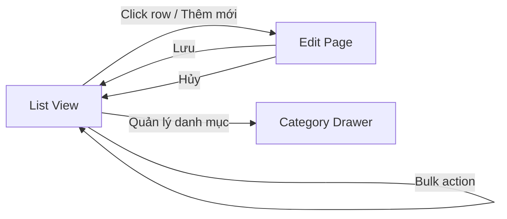

# FAQ Admin Design

> **Trạng thái:** Thiết kế — chưa triển khai  
> **Ngày:** 2026-07-09  
> **Nguyên tắc:** Giống module Quản lý bài viết, nhưng **đơn giản hơn** — không SEO panel phức tạp, không media, không lịch publish

---

## 1. Mục tiêu UX

| Yêu cầu | Cách đáp ứng |
|---------|--------------|
| Không accordion edit hàng loạt | List + Edit page riêng |
| Giống Article Management | Tái sử dụng layout `ProfessionalCmsManager` (list ↔ editor) |
| Đơn giản | Bỏ: featured image, tags, schedule, revision history, OG preview |
| Non-technical admin | Label tiếng Việt, ít field, preview câu trả lời |

---

## 2. Cấu trúc menu

```
Marketing
├── Bài viết          (/marketing/articles)
├── Trang tĩnh        (/marketing/pages)
├── FAQ               (/marketing/faq)           ← redesign
├── Danh mục FAQ      (/marketing/faq/categories) ← mới
└── ...
```

Hoặc gộp **Danh mục FAQ** vào sidebar trong trang FAQ (tab "Danh mục") nếu muốn ít menu hơn.

**Đề xuất:** Tab trong cùng module FAQ — ít menu, dễ tìm.

---

## 3. Luồng CRUD



### 3.1 List View (`/marketing/faq`)

**Layout tham chiếu:** `ArticleListTable` — bảng + filter bar + pagination.

#### Cột hiển thị

| Cột | Mô tả |
|-----|-------|
| ☐ | Checkbox bulk |
| Câu hỏi | Truncate 80 ký tự, click → edit |
| Danh mục | Badge tên category |
| Vị trí | Badges: Guide, Liên hệ, … |
| Nổi bật | ⭐ toggle nhanh (featured) |
| Thứ tự | Số `sort_order` |
| Trạng thái | Draft / Active / Ẩn |
| Lượt xem | `view_count` (optional) |
| Cập nhật | `updated_at` relative |
| ⋮ | Sửa / Nhân bản / Xóa |

#### Filter bar

| Filter | Type |
|--------|------|
| Tìm kiếm | Text — search `question` + `answer` (plain text strip HTML) |
| Danh mục | Select — all categories |
| Vị trí | Multi-select — guide, contact, … |
| Trạng thái | Select — all / draft / active / inactive |
| Nổi bật | Toggle — all / featured only |

#### Pagination

- Mặc định **20/trang**, chọn 20 | 50
- Sort: `sort_order ASC`, `updated_at DESC`

#### Bulk actions

| Action | Mô tả |
|--------|-------|
| Xuất bản | `status → ACTIVE` |
| Ẩn | `status → INACTIVE` |
| Bật nổi bật | `featured → true` (cảnh báo nếu >10 featured) |
| Tắt nổi bật | `featured → false` |
| Xóa | Soft confirm → hard delete |
| Gán vị trí | Modal chọn positions |

#### Nút header

- **+ Thêm FAQ**
- **Quản lý danh mục** (drawer/modal)
- Counter: "Đang có X FAQ nổi bật / tối đa 10 khuyến nghị"

---

### 3.2 Edit Page (`/marketing/faq/[id]` hoặc `?id=`)

**Layout 2 cột** (đơn giản hơn article 3 cột):

```
┌─────────────────────────────────────┬──────────────────┐
│  Câu hỏi (input)                    │  Trạng thái      │
│  Slug (auto từ câu hỏi, editable)   │  Danh mục        │
│  ─────────────────────────────────  │  Vị trí hiển thị │
│  Editor câu trả lời (lite)          │  ☐ Nổi bật TC    │
│                                     │  Thứ tự          │
│                                     │  ─────────────── │
│                                     │  Preview         │
└─────────────────────────────────────┴──────────────────┘
         [Hủy]  [Lưu nháp]  [Xuất bản]
```

#### Fields

| Field | UI | Validation |
|-------|-----|------------|
| `question` | Input text | 3–500 ký tự, required |
| `slug` | Input, auto slugify VI | Unique, 3–255 |
| `answer` | **FaqLiteEditor** | 3–10000 ký tự HTML sanitized |
| `categoryId` | Select | Required |
| `positions` | Checkbox group | Ít nhất 0 (hub vẫn hiện nếu ACTIVE) |
| `featured` | Checkbox | Cảnh báo nếu >10 featured active |
| `sortOrder` | Number input | Default 0 |
| `status` | Select Draft/Active/Inactive | — |

#### FaqLiteEditor (mới — không dùng ProfessionalEditor)

Toolbar tối giản:

```
[B] [I] [•] [1.] [Link] [Undo] [Redo]
```

- TipTap với extension giới hạn
- Không image paste/drop
- Không slash commands
- Không heading (câu hỏi đã là tiêu đề)

#### Preview panel (phải)

Render `answer` qua sanitizer + class `cms-prose` (subset) — xem trước accordion.

#### Lưu

- **Lưu nháp** → `status: DRAFT`
- **Xuất bản** → `status: ACTIVE`
- Auto-save debounce 30s (optional — có thể bỏ để giữ đơn giản)
- **Không** revision history localStorage (khác article CMS)

---

### 3.3 Category management (drawer)

**Route:** Tab trong `/marketing/faq` hoặc `/marketing/faq/categories`

| Cột | Mô tả |
|-----|-------|
| Tên | Input inline |
| Slug | Auto |
| Icon | Select icon đơn giản (dropdown 20 icon phổ biến) |
| Mô tả | Textarea ngắn |
| Thứ tự | Number |
| Trạng thái | Active/Inactive |
| Số FAQ | Count |

- Không xóa category còn FAQ (RESTRICT FK)
- Drag reorder (optional phase 2 — ban đầu dùng sort_order input)

---

## 4. Admin API (REST — thay bulk PUT)

### FAQ Categories

```
GET    /admin/faq/categories
POST   /admin/faq/categories
PATCH  /admin/faq/categories/:id
DELETE /admin/faq/categories/:id   (fail nếu còn FAQ)
```

### FAQs

```
GET    /admin/faqs?q&categoryId&position&status&featured&page&limit&sort
GET    /admin/faqs/:id
POST   /admin/faqs
PATCH  /admin/faqs/:id
DELETE /admin/faqs/:id
PATCH  /admin/faqs/bulk   { ids, patch: { status, featured, positions } }
```

**Permission:** `cms.manage` (giữ nguyên)

### Deprecate

```
GET  /admin/cms/faq      → redirect/alias GET /admin/faqs (1 release)
PUT  /admin/cms/faq      → remove (bulk save)
```

---

## 5. Cảnh báo & guardrails

| Rule | UX |
|------|-----|
| Featured > 10 | Warning banner: "Trang chủ chỉ hiển thị 10 FAQ nổi bật đầu tiên theo thứ tự" |
| Slug trùng | Inline error khi save |
| Xóa category có FAQ | Block + message |
| Answer quá dài | Counter ký tự |
| Paste ảnh vào editor | Strip silently + toast nhẹ |

---

## 6. Component reuse map

| Thành phần | Nguồn | Ghi chú |
|------------|-------|---------|
| List table shell | `ArticleListTable` | Copy + simplify columns |
| List ↔ Editor nav | `ProfessionalCmsManager` | Pattern only |
| Slugify | `slugifyVi` | Reuse |
| Permission gate | `RequirePermission cms.manage` | Reuse |
| Toast / Form UI | `@/components/ui/*` | Reuse |
| Editor | **Mới: `FaqLiteEditor`** | Không dùng ProfessionalEditor |
| Sanitizer | **Mới: FAQ subset** | Stricter than CMS article |

---

## 7. Wireframe text (List)

```
┌─────────────────────────────────────────────────────────────────┐
│ Quản lý FAQ                                    [+ Thêm FAQ]     │
│ Marketing > FAQ                                                 │
├─────────────────────────────────────────────────────────────────┤
│ [🔍 Tìm câu hỏi...] [Danh mục ▼] [Vị trí ▼] [TT ▼] [⭐ Nổi bật] │
├─────────────────────────────────────────────────────────────────┤
│ ☐ │ Câu hỏi              │ DMục    │ Vị trí      │ ⭐ │ TT │ ⋮ │
│ ☐ │ Mua thẻ an toàn?     │ TT      │ Guide       │ ⭐ │ ✓  │ ⋮ │
│ ☐ │ Thanh toán VietQR?   │ TT      │ Guide, LH   │    │ ✓  │ ⋮ │
│ ...                                                             │
├─────────────────────────────────────────────────────────────────┤
│ Bulk: [Xuất bản] [Ẩn] [⭐ Bật] [Xóa]     Trang 1/12  [20 ▼]   │
└─────────────────────────────────────────────────────────────────┘
```

---

## 8. Những gì KHÔNG làm (theo scope)

- ❌ SEO panel đầy đủ (focus keyword, OG…) — slug + schema đủ
- ❌ Featured image
- ❌ Tags
- ❌ Schedule publish
- ❌ Revision history
- ❌ Media library trong FAQ editor
- ❌ Accordion edit all-in-one page (xóa hoàn toàn)
