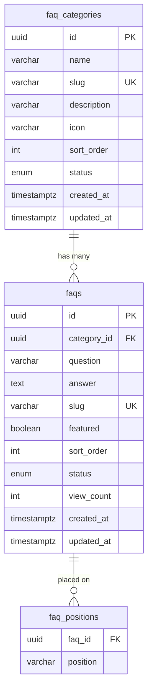

# FAQ Database Design

> **Trạng thái:** Thiết kế — chưa triển khai  
> **Ngày:** 2026-07-09  
> **Phạm vi:** CardOn.vn — FAQ nhẹ, không phải Knowledge Base / Documentation Portal

---

## 1. Đánh giá khả thi

**Kết luận: Khả thi và nên làm ngay (pre-launch).**

CardOn chưa go-live; dữ liệu FAQ hiện nằm trong `system_settings.key = 'cms.faq.items'` (JSON blob). Đây là thời điểm tốt nhất để migrate sang DB mà không cần Phase 1 cải thiện JSON.

| Tiêu chí | Đánh giá |
|----------|----------|
| Phù hợp stack hiện tại (Prisma + NestJS + Next.js) | ✅ Có sẵn pattern tương tự `CmsPage`, `CmsCategory` |
| Rủi ro migration | 🟡 Thấp — ít dữ liệu production, có rollback |
| Effort | ~5–7 ngày dev (xem `FAQ_IMPLEMENTATION_PLAN.md`) |
| Trùng với CMS bài viết | ❌ Không — FAQ tách bảng riêng, tránh lẫn blog/hướng dẫn dài |

---

## 2. Điều chỉnh đề xuất (so với bản draft)

### 2.1 Giữ `featured` + `faq_positions` — nhưng phân vai rõ

Hai field có thể trùng vai nếu không quy ước. Đề xuất:

| Field / Bảng | Vai trò |
|--------------|---------|
| `faqs.featured` | **Chỉ dùng cho trang chủ** — admin đánh dấu tối đa ~10 FAQ nổi bật |
| `faq_positions` | **Vị trí embed** trên guide, contact, và các trang sản phẩm tương lai (garena, viettel…) |

**Quy tắc frontend:**

- Trang chủ: `featured = true` AND `status = ACTIVE` → sort `sort_order`, limit 10
- Guide: join `faq_positions.position = 'guide'`
- Contact: join `faq_positions.position = 'contact'`
- Hub `/tro-giup`: tất cả FAQ ACTIVE (không filter position)

> **Lý do:** Trang chủ cần curate thủ công (10 câu hay nhất). Guide/Contact cần gán linh hoạt theo vị trí mà không bắt buộc featured.

### 2.2 Slug — unique toàn cục (global)

Đề xuất `@@unique([slug])` trên bảng `faqs`, không phải unique theo category.

**Lý do:** URL `/tro-giup/[category-slug]/[faq-slug]` vẫn hoạt động; slug global tránh trùng khi share link trực tiếp `/tro-giup/thanh-toan/...`.

### 2.3 `icon` trên category — lưu string, không upload

Lưu tên icon Lucide/Heroicons hoặc emoji (VARCHAR 32), không dùng media library.

**Lý do:** Giữ admin đơn giản; tránh thêm bước upload cho FAQ category.

### 2.4 Status — enum 3 giá trị

```prisma
enum FaqStatus {
  DRAFT      // Nháp — không hiện public
  ACTIVE     // Xuất bản
  INACTIVE   // Ẩn — giữ dữ liệu, không xóa
}
```

**Lý do:** Admin không kỹ thuật cần nháp trước khi publish; `INACTIVE` giữ lịch sử thay vì xóa cứng.

### 2.5 `view_count` — optional, increment khi mở chi tiết

Chỉ tăng khi user mở trang detail SEO (`/tro-giup/[cat]/[slug]`) hoặc expand trên hub (debounce 1 lần/session). Không bắt buộc cho MVP.

---

## 3. ERD



---

## 4. Prisma Schema (đề xuất cuối)

```prisma
enum FaqStatus {
  DRAFT
  ACTIVE
  INACTIVE
}

enum FaqCategoryStatus {
  ACTIVE
  INACTIVE
}

model FaqCategory {
  id          String            @id @default(uuid()) @db.Uuid
  name        String            @db.VarChar(128)
  slug        String            @unique @db.VarChar(128)
  description String?           @db.VarChar(512)
  icon        String?           @db.VarChar(32)
  sortOrder   Int               @default(0) @map("sort_order")
  status      FaqCategoryStatus @default(ACTIVE)
  createdAt   DateTime          @default(now()) @map("created_at") @db.Timestamptz(6)
  updatedAt   DateTime          @updatedAt @map("updated_at") @db.Timestamptz(6)

  faqs Faq[]

  @@index([status, sortOrder])
  @@map("faq_categories")
}

model Faq {
  id         String    @id @default(uuid()) @db.Uuid
  categoryId String    @map("category_id") @db.Uuid
  question   String    @db.VarChar(500)
  answer     String    @db.Text
  slug       String    @unique @db.VarChar(255)
  featured   Boolean   @default(false)
  sortOrder  Int       @default(0) @map("sort_order")
  status     FaqStatus @default(DRAFT)
  viewCount  Int       @default(0) @map("view_count")
  createdAt  DateTime  @default(now()) @map("created_at") @db.Timestamptz(6)
  updatedAt  DateTime  @updatedAt @map("updated_at") @db.Timestamptz(6)

  category  FaqCategory   @relation(fields: [categoryId], references: [id], onDelete: Restrict)
  positions FaqPosition[]

  @@index([categoryId])
  @@index([status, sortOrder])
  @@index([featured, status, sortOrder])
  @@map("faqs")
}

model FaqPosition {
  faqId    String @map("faq_id") @db.Uuid
  position String @db.VarChar(64)

  faq Faq @relation(fields: [faqId], references: [id], onDelete: Cascade)

  @@id([faqId, position])
  @@index([position])
  @@map("faq_positions")
}
```

---

## 5. Indexes — giải thích

| Index | Mục đích |
|-------|----------|
| `faqs.slug` UNIQUE | URL SEO, lookup nhanh |
| `faqs(category_id)` | Filter theo danh mục trên hub |
| `faqs(status, sort_order)` | List public sorted |
| `faqs(featured, status, sort_order)` | Trang chủ — featured top 10 |
| `faq_positions(position)` | Filter guide/contact/product pages |
| `faq_categories(status, sort_order)` | Sidebar category trên hub |

---

## 6. Position values — registry

Giá trị `faq_positions.position` là **string có kiểm soát** (không FK) để mở rộng linh hoạt:

| Position | Trang frontend | Ghi chú |
|----------|----------------|---------|
| `guide` | `/huong-dan` | Embed 10–15 FAQ |
| `contact` | `/lien-he` | Embed 8–10 FAQ |
| `garena` | (tương lai) trang sản phẩm | Optional |
| `viettel` | (tương lai) | Optional |
| `mobifone` | (tương lai) | Optional |

**Không dùng position `homepage`** — trang chủ dùng `featured` flag.

Danh sách position hợp lệ khai báo trong code (`FAQ_POSITIONS` constant) + validate API.

---

## 7. Quan hệ & ràng buộc

| Quan hệ | On Delete |
|---------|-----------|
| `faqs.category_id → faq_categories.id` | **RESTRICT** — không xóa category còn FAQ |
| `faq_positions.faq_id → faqs.id` | **CASCADE** — xóa FAQ thì xóa positions |

**Không duplicate nội dung:** Một FAQ có nhiều `faq_positions` rows; cùng `answer` text, không copy row.

---

## 8. API data shape (tham chiếu)

### Public FAQ item

```json
{
  "id": "uuid",
  "question": "Mua thẻ có an toàn không?",
  "answer": "<p>CardOn cam kết...</p>",
  "slug": "mua-the-co-an-toan-khong",
  "featured": true,
  "sortOrder": 1,
  "category": {
    "id": "uuid",
    "name": "Thanh toán",
    "slug": "thanh-toan",
    "icon": "credit-card"
  },
  "positions": ["guide", "contact"]
}
```

---

## 9. HTML answer — sanitizer subset

Tách sanitizer FAQ khỏi CMS article (full rich text):

**Cho phép:** `p`, `br`, `strong`, `em`, `b`, `i`, `ul`, `ol`, `li`, `a`

**Không cho phép:** `img`, `iframe`, `table`, `video`, `embed`, `h1–h6` (giữ FAQ gọn — question đã là heading)

File đề xuất: `src/modules/faq/entities/faq-html-safety.ts`

---

## 10. Deprecation JSON cũ

Sau migration thành công:

1. Giữ `system_settings.cms.faq.items` **read-only backup** 30 ngày
2. Xóa code đọc/ghi JSON
3. (Optional) Xóa key backup sau xác nhận UAT

Không cần backward compat API v1/v2 lâu dài vì pre-launch.
