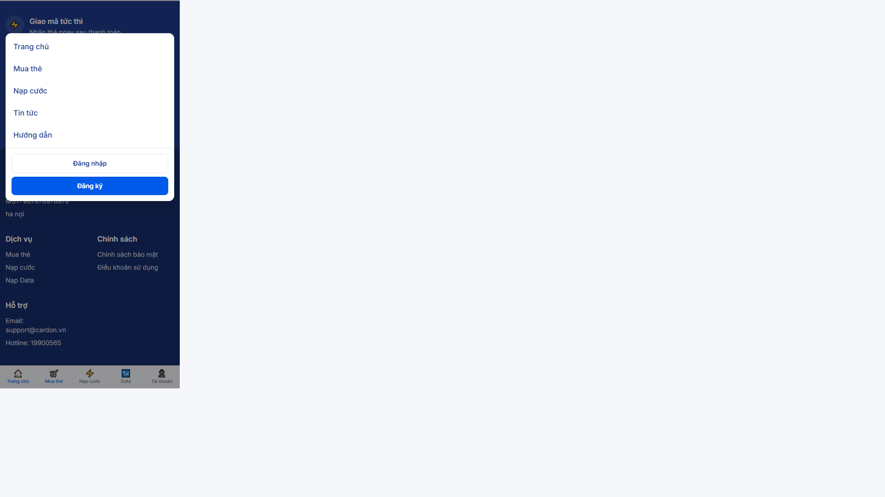

# Phase 6O.7.1 — Force Local Deployment Refresh

**Date:** 2026-06-23  
**Goal:** Confirm localhost runs Phase 6O.7 code after clean rebuild. No feature changes beyond deploy verification markers and cache headers.

---

## Root cause of stale UAT

Previous deploy recreated `web`/`admin`/`api` containers but **nginx** was not recreated, causing **502 Bad Gateway** (stale upstream IP). This refresh rebuilds all app images with `--no-cache`, recreates the full stack (including nginx), and adds a build marker for quick verification.

---

## Task 1 — Container version marker

### Build marker added

| Item | Value |
|------|-------|
| Env | `WEB_BUILD_VERSION=6O7` |
| Console | `WEB_BUILD_VERSION=6O7` (Footer `useEffect`) |
| HTML | `<!-- CardOn build 6O7 -->` via `BuildVersionComment` |

### Container timestamps (after refresh)

| Container | Created (UTC) | Status |
|-----------|---------------|--------|
| `cardon-local-full-web` | 2026-06-23T08:13:47Z | healthy |
| `cardon-local-full-admin` | 2026-06-23T08:13:47Z | healthy |
| `cardon-local-full-api` | 2026-06-23T08:13:47Z | healthy |
| `cardon-local-full-nginx` | 2026-06-23T08:13:48Z | healthy |

### Browser verification

```powershell
curl.exe -s http://localhost/ | Select-String "CardOn build 6O7"
# FOUND: CardOn build 6O7
```

DevTools Console on homepage shows: `WEB_BUILD_VERSION=6O7`

---

## Task 2 — Clean rebuild commands run

```powershell
Remove-Item -Recurse -Force apps\web\.next, apps\admin\.next

docker compose -f docker-compose.local-full.yml --env-file .env.local-full down

docker compose -f docker-compose.local-full.yml --env-file .env.local-full build --no-cache web admin api

docker compose -f docker-compose.local-full.yml --env-file .env.local-full up -d
```

All three images rebuilt from scratch. Full stack recreated including nginx.

---

## Task 3 — Database migration

```bash
docker exec cardon-local-full-api npx prisma migrate deploy
docker exec cardon-local-full-api npx prisma generate
```

Result: **17 migrations applied**, no pending migrations.

Schema fields present for 6O.7:

- `ProductCategory.iconUrl`
- `Product.logoUrl`, `Product.bannerUrl`
- CMS theme key `cms.theme.mobile_nav` (`mobileNav` in API)

---

## Task 4 — In-container source verification

### Web container (`cardon-local-full-web`)

| Grep target | Found |
|-------------|-------|
| `mobileNav` / `MobileBottomNav` | Yes — in `.next/server/chunks` |
| `max-md:grid-cols-2` (mobile footer) | Yes — in built CSS/JS |
| `top-[72px]` (compact menu) | Yes — in client bundle |
| `homepage` (FAQ category) | Yes — in static chunks |
| `BuildVersionComment` / `WEB_BUILD_VERSION` | Yes |

### API container (`cardon-local-full-api`)

| Grep target | Found |
|-------------|-------|
| `iconUrl`, `logoUrl` | Yes — in `dist/modules/product` |
| `MOBILE_NAV` | Yes — in CMS constants |

### Admin container (`cardon-local-full-admin`)

| Grep target | Found |
|-------------|-------|
| `mobileNav` (Appearance editor) | Yes — in `marketing/appearance` server bundle |

---

## Task 5 — Cache headers

### Theme API

```powershell
curl.exe -s -D - http://localhost/api/v1/cms/theme -o NUL | findstr /I cache-control
# Cache-Control: no-store
```

Backend: `@Header('Cache-Control', 'no-store')` on `GET /cms/theme`.

### Next.js fetch

- Client: `fetchThemeSettingsClient()` uses `cache: 'no-store'`
- Server metadata: `getThemeSettings()` now delegates to `fetchThemeSettingsClient()` (no ISR revalidate)

**Browser tip:** Hard refresh (`Ctrl+Shift+R`) or DevTools → Disable cache when verifying UI changes.

---

## Task 6 — Final UI verification

### Verified on http://localhost (mobile viewport 390×844)

| Check | Result |
|-------|--------|
| Build marker in HTML | `<!-- CardOn build 6O7 -->` present |
| Mobile footer: company full width + 2-col menu | Pass — CMS company block + Dịch vụ/Chính sách/Hỗ trợ grid |
| Mobile header: compact dropdown (not full drawer) | Pass — panel below header with Login/Register |
| CMS bottom nav (5 items) | Pass — Trang chủ, Mua thẻ, Nạp cước, Data, Tài khoản |
| Product cards 6O.7 layout | Pass — 2-col grid, rounded cards, letter fallback (G/Z) |
| Product uploaded logos | **Pending data** — API returns `logoUrl: null` for all products; upload via Admin → Products → Edit → Logo |
| Homepage FAQ CMS | **API wired** — `GET /cms/faq?category=homepage` returns `[]`; add items in Admin → Marketing → FAQ with category `homepage` |

### Screenshot

Mobile compact menu (Phase 6O.7):



---

## Quick verify checklist (for UAT)

1. View page source → search `CardOn build 6O7`
2. DevTools Console → `WEB_BUILD_VERSION=6O7`
3. Mobile width → footer company block on top, 2-column links below
4. Tap ☰ → compact dropdown (not side drawer)
5. Bottom nav shows 5 CMS items
6. Admin → Products → upload Garena/Zing logos → refresh homepage
7. Admin → FAQ → add entries with category `homepage` → FAQ section appears

---

## Files changed (6O.7.1 only)

- `apps/web/lib/build-version.ts` — version constant
- `apps/web/components/layout/BuildVersionComment.tsx` — HTML comment marker
- `apps/web/components/layout/Footer.tsx` — console log
- `apps/web/app/layout.tsx` — render build comment
- `apps/web/lib/cms-api.ts` — server theme fetch uses `no-store`
- `src/modules/cms/controllers/cms-public.controller.ts` — `Cache-Control: no-store` on theme
- `docker/Dockerfile.frontend` — `WEB_BUILD_VERSION` build arg
- `docker-compose.local-full.yml` — pass `WEB_BUILD_VERSION: "6O7"` to web

---

## If localhost shows old UI again

1. Confirm build marker: View Source → `CardOn build 6O7`
2. If missing → rebuild web: `docker compose ... build --no-cache web && docker compose ... up -d web nginx`
3. Hard refresh browser or use Incognito
4. After any container recreate, ensure nginx is also recreated/restarted (prevents 502 stale IP)
